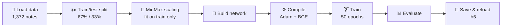
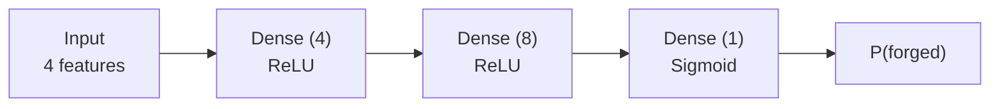
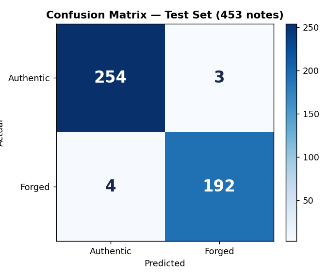

# 🧠 Keras Basics — Banknote Authentication

[](https://colab.research.google.com/github/MMujtabaX/Keras/blob/main/00_Keras_Basics.ipynb)


My first neural network with **Keras**. It covers the full deep learning workflow end to end (load, split, scale, build, train, evaluate, save, reload) on a real classification task: detecting **forged banknotes**.

## 📌 The Problem

The [Banknote Authentication dataset](https://archive.ics.uci.edu/dataset/267/banknote+authentication) contains **1,372 banknotes**. Each is described by 4 statistical features extracted from wavelet-transformed images of the note:

| Feature | Description |
|---------|-------------|
| Variance | Variance of the wavelet-transformed image |
| Skewness | Asymmetry of the distribution |
| Curtosis | "Tailedness" of the distribution |
| Entropy | Randomness of the image |

The goal is to classify each note as **authentic (0)** or **forged (1)**. The inputs are image *features*, not raw images.

## 🔄 Workflow



## 🧱 Network Architecture



```python
model = Sequential()
model.add(Dense(4, input_dim=4, activation='relu'))
model.add(Dense(8, activation='relu'))
model.add(Dense(1, activation='sigmoid'))

model.compile(loss='binary_crossentropy', optimizer='adam', metrics=['accuracy'])
model.fit(scaled_X_train, y_train, epochs=50)
```

A tiny network (just **69 trainable parameters**) is enough for this problem.

## 📊 Results

Evaluated on **453 unseen banknotes**:

| Metric | Score |
|--------|-------|
| **Test Accuracy** | **98.5%** |
| Test Loss (BCE) | 0.076 |
| Precision (macro) | 0.98 |
| Recall (macro) | 0.98 |
| F1 (macro) | 0.98 |

<p align="center">
  
</p>

Only **7 of 453** notes were misclassified: 3 authentic notes flagged as forged and 4 forged notes missed.

## 🎯 What I Learned

- Building a feed-forward network with the Keras **Sequential API**
- Why **scaling** matters for neural networks, and why the scaler is fit on training data only
- Choosing an output layer and loss for binary classification: **sigmoid + binary cross-entropy**
- Turning predicted probabilities into class labels with a 0.5 threshold
- Evaluating beyond accuracy with a **confusion matrix and classification report**
- **Saving and reloading** a trained model

## 🚀 Run It

Click the **Open in Colab** badge above, or run it locally:

```bash
pip install tensorflow scikit-learn numpy jupyter
jupyter notebook 00_Keras_Basics.ipynb
```

## 👤 Author

**Muhammad Mujtaba Khan Suri** — CS @ UBIT, University of Karachi
[GitHub](https://github.com/MMujtabaX)
